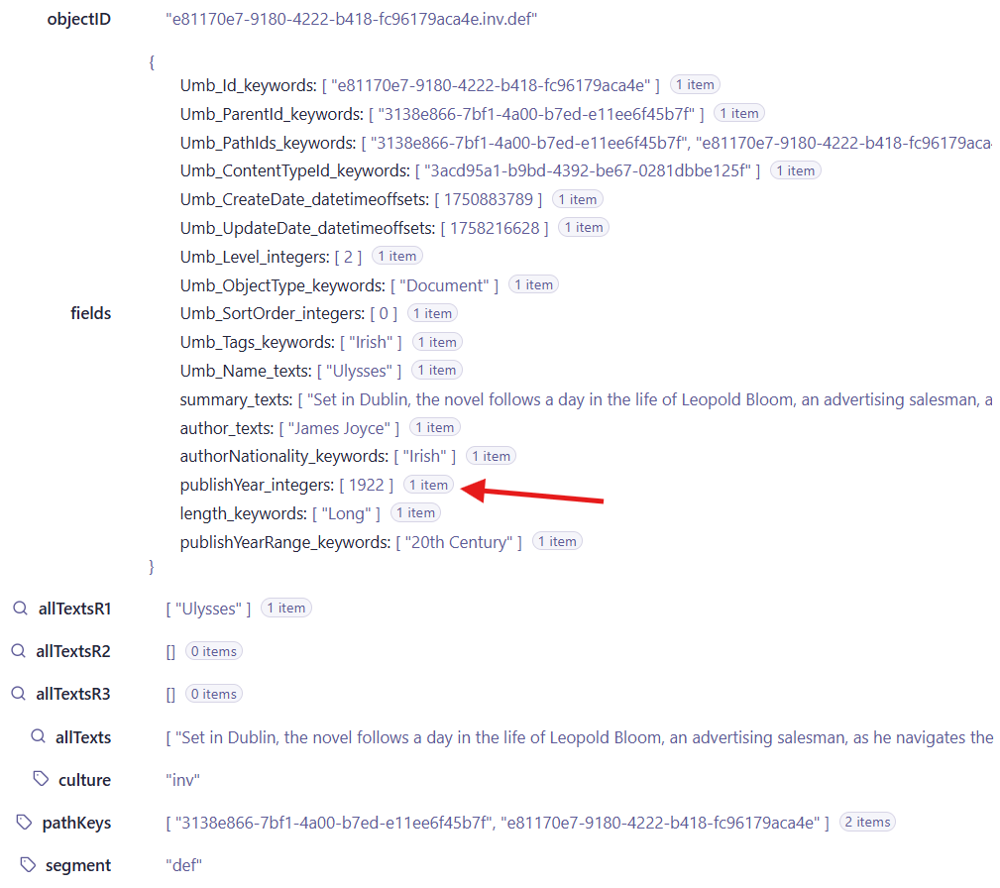
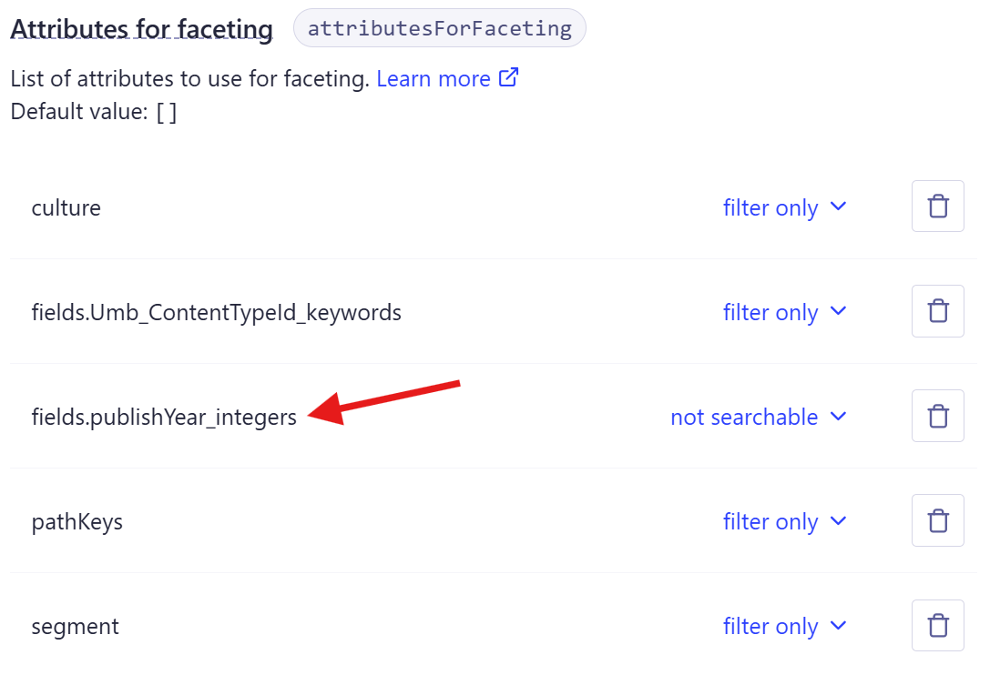
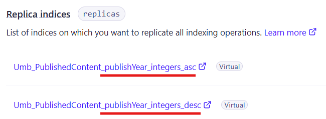

# Umbraco search provider for Algolia

This repo contains an alternative search provider for [Umbraco search](https://github.com/umbraco/Umbraco.Cms.Search/), based on [Algolia](https://www.algolia.com/).

## Prerequisites

An Algolia account 😛

## Installation

The package is installed from [NuGet](https://www.nuget.org/packages/Kjac.SearchProvider.Algolia):

```bash
dotnet add package Kjac.SearchProvider.Algolia
```

Once installed, add the search provider to Umbraco by means of composition:

```csharp
using Kjac.SearchProvider.Algolia.DependencyInjection;
using Umbraco.Cms.Core.Composing;

namespace My.Site;

public class SiteComposer : IComposer
{
    public void Compose(IUmbracoBuilder builder)
        => builder.AddAlgoliaSearchProvider();
}
```

## Connecting to Algolia

You'll need to configure the search provider, so it can connect to your Algolia account.

This is done either via `appsettings.json`:

```json
{
    "AlgoliaSearchProvider": {
        "Client": {
            "AppId": "[your app ID]",
            "ApiKey": "[your API key]"
            // use LogLevel to debug connection issues
            //"LogLevel": "Debug"
        }
    }
}
```

...or using `IOptions`:

```csharp
using Kjac.SearchProvider.Algolia.Configuration;
using Kjac.SearchProvider.Algolia.DependencyInjection;
using Umbraco.Cms.Core.Composing;

namespace My.Site;

public class SiteComposer : IComposer
{
    public void Compose(IUmbracoBuilder builder)
    {
        builder.AddAlgoliaSearchProvider();

        builder.Services.Configure<ClientOptions>(options =>
            {
                options.ApiKey = "[your API key]";
                options.AppId = "[your app ID]";
                // use LogLevel to debug connection issues
                //options.LogLevel =  LogLevel.Debug;
            }
        );
    }
}
```

## Algolia configuration

Algolia is not just another document database. For one, it has a comprehensive management UI to configure many the things that makes Algolia special.

To use the search provider beyond the absolute basics, you'll need to perform manual configuration of your Algolia indexes (indices) to match your requirements.

### Filtering and facets

Algolia requires an up-front declaration of fields (attributes) that will be used for [filtering](https://www.algolia.com/doc/guides/managing-results/refine-results/filtering) and [faceting](https://www.algolia.com/doc/guides/managing-results/refine-results/faceting) in search queries. That's no different when using this search provider for querying.

As an example: If you have an Umbraco integer property with the alias `publishYear`, the property value(s) will be indexed as the field `fields.publishYear_integers[]`: 



You'll need to declare that field as being used for filtering and/or faceting, depending on your concrete search requirements:



Only then can the `publishYear` be used in search queries as an `IntegerExactFilter`, `IntegerRangeFilter` or `IntegerExactFacet`.

> [!NOTE]
> At the time of writing, the search provider does not support negated filters.

> [!NOTE]
> The [typo tolerance](https://www.algolia.com/doc/guides/managing-results/optimize-search-results/typo-tolerance) in Algolia might need tweaking if you expect to perform filtering on near-identical values within the same field.

### Sorting

Algolia [sorting](https://www.algolia.com/doc/guides/managing-results/refine-results/sorting) works somewhat differently than other document databases. It relies on a concept called "virtual replicas" to perform relevance sorting.

In short, you must configure a virtual replica per index for each distinct sorting option you need.

The search provider expects virtual replicas when sorting by anything else than score descending (relevance sorting). These virtual replicas must be named by the convention `[index name]_[field name]_[asc/desc]`.

As an example: If you want to sort the default published content index (`Umb_PublishedContent`) both ascending and descending by the `publishYear` property from the previous example, you'll need to define two virtual replicas:



> [!NOTE]
> At the time of writing, the search provider does not support sorting by score ascending (reverse relevance sorting).

## Extendability

Generally, you should look to Umbraco search for extension points. There are however a few notable extension points in this search provider as well.

### Custom index data format

One of the unique selling points for Algolia is the ability to tweak and fine-tune search results from the Algolia UI.

To get the most from Algolia, arguably the index data should be easily understandable for the Algolia editors. And quite frankly, the search provider data format is not a simple one (see the screenshot above). But as it happens, the complexity of the search provider data model is necessary, due to the dynamic nature of the Umbraco content types.

But... you can simplify the data format by replacing the default [`IIndexDocumentBuilder`](https://github.com/kjac/Kjac.SearchProvider.Algolia/blob/main/src/Kjac.SearchProvider.Algolia/Services/Indexing/IAlgoliaIndexManager.cs) with your own implementation. The test site in this repo contains a simple [sample implementation](https://github.com/kjac/Kjac.SearchProvider.Algolia/blob/main/src/Kjac.SearchProvider.Algolia.Site/Services/Indexing/BookIndexDocumentBuilder.cs) for inspiration.

In doing so, it is _highly unlikely_ that the search provider will be able to perform meaningful search queries. In other words, when using your own `IIndexDocumentBuilder` implementation, you should rely on the Algolia clients (like [InstantSearch](https://www.algolia.com/doc/guides/building-search-ui/what-is-instantsearch/js)) for querying.

> [!TIP]
> The search provider indexing will of course continue to function with a custom `IIndexDocumentBuilder` implementation.

The test site project in this repository contains a sample implementation you can use as a reference point - the [`BookIndexDocumentBuilder`](https://github.com/kjac/Kjac.SearchProvider.Algolia/blob/main/src/Kjac.SearchProvider.Algolia.Site/Services/Indexing/BookIndexDocumentBuilder.cs). It produces a data format that is quite a lot easier to understand:


### Index management

The required Algolia indexes are created automatically by the search provider. When the search provider creates indexes, it configures the required searchable and filterable fields.

You _can_ of course change these field configurations using the Algolia UI. However, if you plan to use the search provider for querying, you should _not_ alter these field configurations - but of course, you can still add additional field configurations to support your concrete search requirements.

If you want full control over the index creation, you can replace the [`IAlgoliaIndexManager`](https://github.com/kjac/Kjac.SearchProvider.Algolia/blob/main/src/Kjac.SearchProvider.Algolia/Services/IAlgoliaIndexManager.cs) and handle index creation in the way you see fit:

```csharp
using Kjac.SearchProvider.Algolia.Services;
using Umbraco.Cms.Core.Composing;

namespace My.Site;

public class MyAlgoliaIndexManager : IAlgoliaIndexManager
{
    // ...
}

public class MyIndexManagerComposer : IComposer
{
    public void Compose(IUmbracoBuilder builder)
        => builder.Services.AddUnique<IAlgoliaIndexManager, MyAlgoliaIndexManager>();
}
```

## Limitations

### Range facets

Apparently, Algolia doesn't support range facets.

To make this search provider work as a drop-in replacement for the default search provider, it treats range faceting somewhat like as exact keyword faceting.

If you need range facet functionality, you'll have to use pre-calculated value buckets applicable for querying as exact facets. The `IContentIndexer` from Umbraco Search is feasible for calculating these value buckets.

The test site in this repo contains a working [sample implementation](https://github.com/kjac/Kjac.SearchProvider.Algolia/blob/main/src/Kjac.SearchProvider.Algolia.Site/Indexing/BookContentIndexer.cs) of `IContentIndexer` for inspiration. See also how range faceting is applied in the test site [API controller](https://github.com/kjac/Kjac.SearchProvider.Algolia/blob/main/src/Kjac.SearchProvider.Algolia.Site/Controllers/BooksApiController.cs).

### Segments

The search provider currently does _not_ support segments.

Segments are somewhat dynamic of nature, and thus would require a lot of manual setup via the Algolia management UI, even if the search provider supported them.

> [!TIP]
> I am quite willing to consider segment support, if you're interested in contributing with a solution. Feel free to raise an issue so we can discuss it.

## Contributing

Yes, please ❤️

When raising an issue, please make sure to include plenty of context, steps to reproduce and any other relevant information in the issue description 🥺

If you're submitting a PR, please:

1. Also include plenty of context and steps to reproduce.
2. Make sure your code follows the provided editor configuration.
3. If at all possible, create tests that prove the issue has been fixed.
    - You'll find instructions on running the tests [here](https://github.com/kjac/Kjac.SearchProvider.Algolia/tree/main/src/Kjac.SearchProvider.Algolia.Tests).
